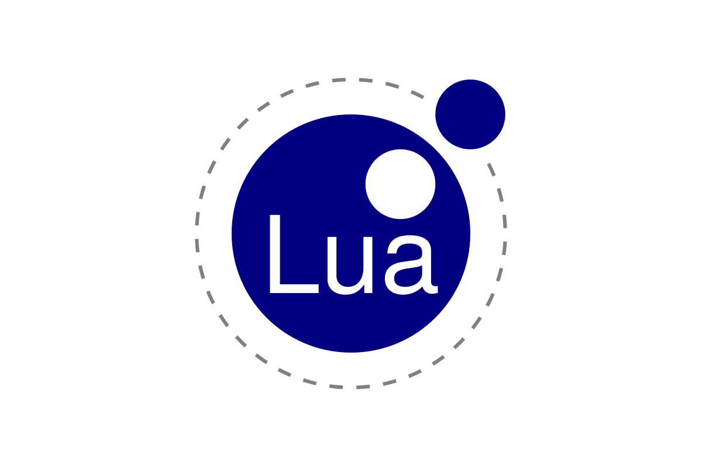

# Introdução

## O que é Lua?
Lua é uma linguagem de programação que surgiu em 1993 no Brasil no Laboratório da [**PUC-Rio**](https://pt.wikipedia.org/wiki/Pontif%C3%ADcia_Universidade_Cat%C3%B3lica_do_Rio_de_Janeiro). Os criadores são [**Roberto Ierusalimschy**](https://pt.wikipedia.org/wiki/Roberto_Ierusalimschy), [**Luiz Henrique de Figueiredo**](https://lhf.impa.br/) e [**Waldemar Celes**](https://www.inf.puc-rio.br/blog/professor/waldemar-celes/) os quais são membros do Tecgraf onde o precursos de Lua foi o SOL (Simple Object Language) and DEL (data-entry language)[^1].

[^1]: Caso queira saber a fundo a história da linguagem Lua, leia: [**The evolution of an extension language: a history of Lua**](https://www.lua.org/history.html).
